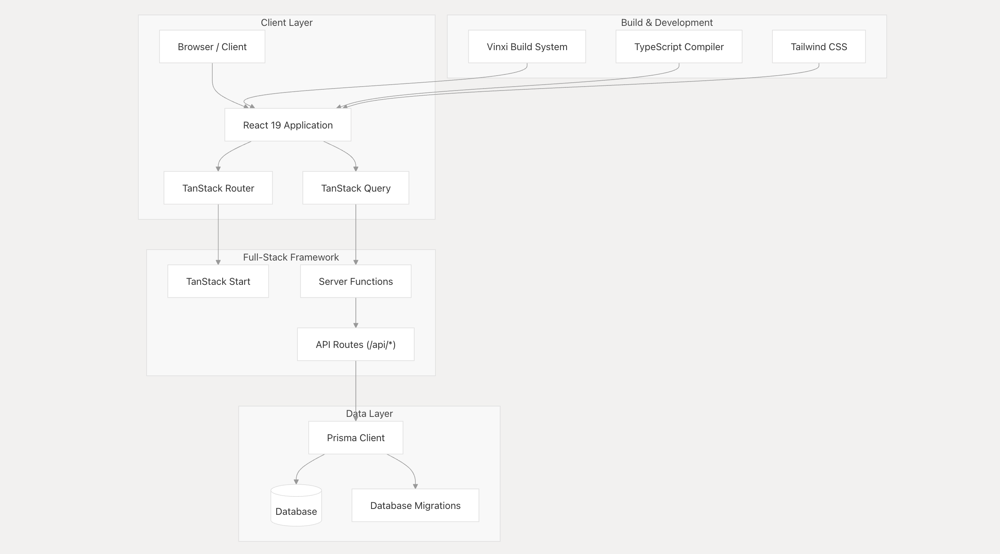
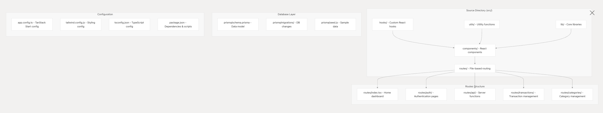

# 🦋 Monfly

Monfly is a modern, full-stack personal finance dashboard that helps you track transactions, categorize expenses, set budgets, and visualize your money—all in one place.

## 🚀 Overview

Monfly provides an integrated solution for personal financial management. You can track and categorize your financial activity, set alerts, analyze spending with beautiful dashboards, and manage your profile with secure authentication.

### 📂 Relevant Files

```text
.gitignore
.prettierignore
README.md
app.config.ts
package.json
pnpm-lock.yaml
src/components/ui/popover.tsx
```

### 🎯 Purpose and Scope

Monfly enables users to:
• Manage income and expense transactions
• Categorize and analyze spending patterns
• Set budgets and receive notifications
• Securely manage user profiles and authentication
• Visualize financial data with interactive charts

This document provides a high-level overview of the Monfly architecture, technology stack, features, and project structure.

### ✨ Key Features

Category Capabilities
Transaction Management Create, edit, categorize, and track transactions
Category System Custom categories for expenses and income
Dashboard Analytics Real-time balance, spending trends, and visual insights
Visual Reporting Interactive charts (bar, radar, monthly analysis, etc.)
User Management Secure authentication, profile management
Notifications Alerts for spending, budgets, and system notifications

### 🛠️ Technology Stack

• Frameworks:
• TanStack Start (@tanstack/start)
• TanStack Router (@tanstack/react-router)
• React 19 + TypeScript 5
• State & Forms:
• TanStack Query (@tanstack/react-query)
• React Hook Form
• Zod
• Database & Backend:
• Prisma ORM
• bcrypt (auth)
• PostgreSQL or SQLite
• UI & Styling:
• Tailwind CSS 4
• Radix UI
• Lucide React (icons)
• next-themes (theming)
• Visualization & Dates:
• Recharts (analytics)
• React Day Picker
• Dev & Build Tools:
• Vinxi (build system)
• Jest & React Testing Library
• ESLint & Prettier

### 📐 System Architecture



### 🏛️ Code & File Structure

```text
src/
├─ components/ # Reusable UI components
├─ hooks/ # Custom hooks
├─ lib/ # Core utilities & API
├─ queries/ # Query keys, helpers
├─ routes/ # File-based routing (pages, APIs)
├─ utils/ # Utility functions
├─ prisma/ # Schema, migrations, seeds
│ ├─ schema.prisma
│ ├─ migrations/
│ └─ seed.js
├─ app.config.ts # TanStack config
├─ tailwind.config.js # Styling config
└─ tsconfig.json # TypeScript config
```



### 🏦 Core Entities

Entity Purpose Relationships
User Account, authentication Owns all financial data
Transaction Single income/expense Belongs to User & Category
Category Classifies expense/income Created by User, linked to transactions
Budget Set limits & financial goals Linked to User, Category
Card Payment method tracking Linked to User & Transactions
MonthlySummary Aggregated financial data Calculated from User’s transactions

### 🔐 Authentication & Security

• Passwords hashed with bcrypt
• Server-side sessions using TanStack Start
• Protected routes and APIs
• Type-safe validation with Zod

### 🖥️ User Interface & Analytics

• Component-driven UI (Radix + Tailwind)
• Dark/light mode (next-themes)
• Accessible forms (React Hook Form + Zod)
• Charts (Recharts):
• Income/expense over time
• Category breakdown (bar, radar, pie)
• Monthly/yearly trend analysis

## Edit models

```bash
pnpm prisma migrate dev --name some-name # Migration
pnpm prisma generate # Generate types
pnpm prisma studio # GUI
```

API & Server Functions
• File-based APIs: `routes/api/_.ts → /api/_`

Build & Deploy

```bash
pnpm dev # Start dev server
pnpm build # Production build
```

## 🧪 Testing & Quality

• Jest & React Testing Library: Components and integration tests
• ESLint: Linting with TypeScript, React, Tailwind, a11y
• Prettier: Formatting with import sorting
• Strict TypeScript: Compile-time error prevention

```bash
📁 src/
├── 📁 components/
│   ├── 📃 Button.tsx
│   ├── 🧪 Button.test.tsx
│   ├── 📃 TransactionForm.tsx
│   ├── 🧪 TransactionForm.test.tsx
├── 📁 hooks/
│   ├── 📃 useDarkMode.ts
│   ├── 🧪 useDarkMode.test.ts
├── 📁 utils/
│   ├── 📃 formatCurrency.ts
│   ├── 🧪 formatCurrency.test.ts
```

## 📚 More Docs

• CONTRIBUTING.md — Guidelines for contributions
• System Architecture
• Database Schema
• Frontend Architecture
• Authentication System

## 📝 License

MIT

⸻

Feel free to open issues, suggest features, or contribute to Monfly!
